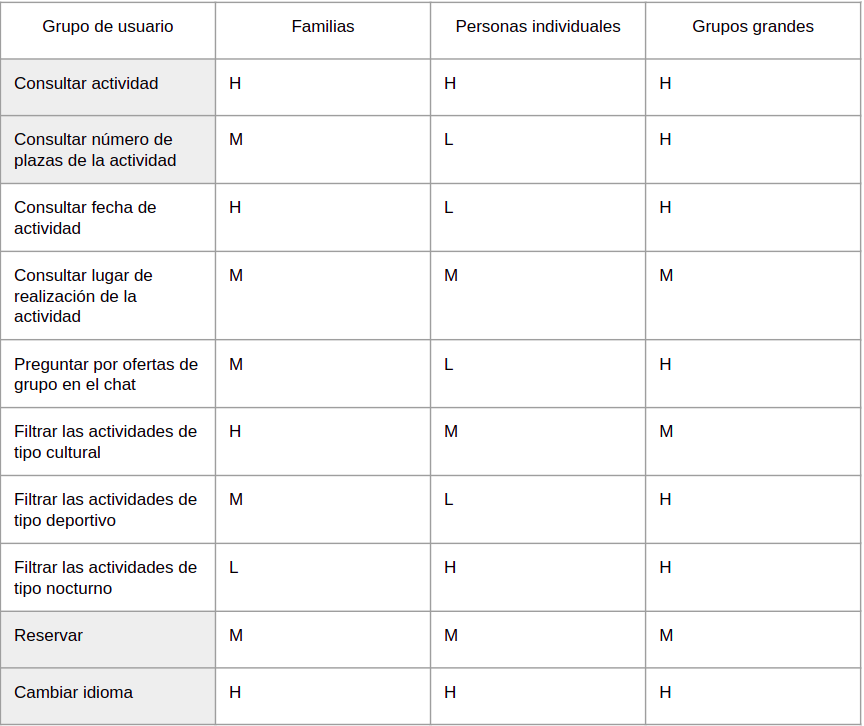
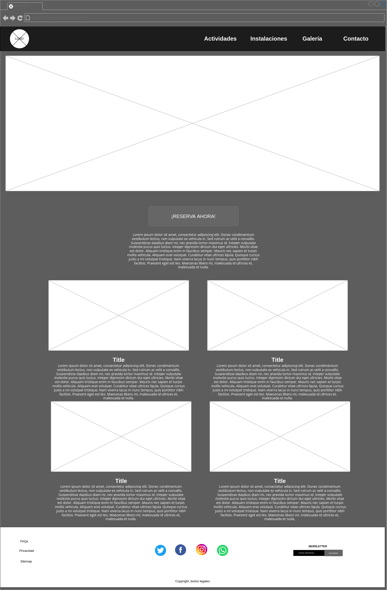
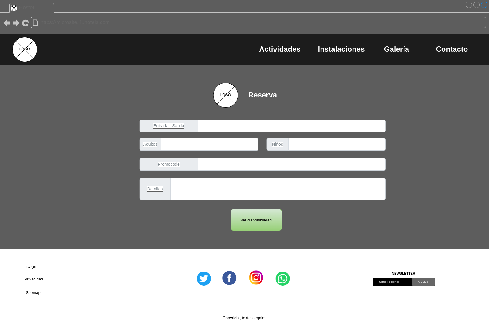

## DIU - Practica2, entregables

El microsite web que vamos a diseñar consiste en un sitio web en el que los distintos clientes interesados en visitar nuestro hostel puedan encontrar todas las actividades que se ofertan, incluyendo numerosos detalles de cada una de las actividades. Además, vamos a hacer especial hincapié en mantener los puntos fuertes de la página principal del hostel. De esta manera, podremos animar al usuario objetivo a que reserve.

Las funciones principales del microsite son anunciar las diferentes actividades disponibles de la forma más atractiva posible. Esto se realizará mediante la muestra de imágenes descriptivas de las actividades. Estas actividades serán ordenadas según el interés del usuario y fecha cercana a la actual. Por último, pondremos un botón de reserva visible y atractivo para que el usuario pueda reservar.

Se dará la posibilidad de reservar una actividad y si se hace con antelación, bonificar con un descuento en la reserva. De esta manera, animamos al usuario tanto a asistir a la actividad reservando con antelación y sabiendo el número de gente que puede asistir, y además garantizar la diferenciación con la competencia.

### Ideación: Malla receptora de información

Hemos empezado considerando las experiencias de usuario recogidas durante la anterior práctica. Una vez hecho eso, hemos decido usar una malla receptora de información con el objetivo de organizar el conocimineto adquirido. Como es común en una malla receptora de información, hemos clasificado la información en:

- Worked: aspectos positivos que haya sentido el usuario
- Change: aspectos negativos que haya sufrido el usuario
- Questions: dudas que presenta el usuario
- Ideas: ideas producidas por el usuario

### PROPUESTA DE VALOR: ScopeCanvas

El microsite que vamos a diseñar será una página web destinada a publicitar las actividades e instalaciones del hostel 4UHostel. Esta página está diseñada siguiendo el estilo de la original pero reforzando y mejorando sus puntos débiles: como la existencia de botones sin uso, formularios, falta de información, etc.

La función principal del microsite es la reserva de habitaciones en el hostel, a través del interés en las distintas actividades e instalaciones del hostel. Para esto, hemos prestado especial atención al uso de imágenes de alta calidad y de un gran tamaño.

Lo primero que verá el usuario al entrar a la página será una gran imagen especilmente creada para realzar el atractivo del hostel. Posteriormente, y tras un breve scroll, el usuario podrá ver una cantidad moderada de imágenes representativas de cada uno de las actividades. Junto con un pequeño texto explicando la actividad y un botón para reserver en el hostel en una fecha que incluya la actividad.

El usuario dispondrá de dos secciones diferentes donde consultar información más extensa sobre actividades e instalaciones. Además también crearemos una página para que pueda ver una serie de fotos de distintos clientes usando el hostel.

### TASK ANALYSIS

Hemos decidido categorizar a los usuarios que puedan acudir a nuestro hotel como: 
 
- Familias
- Personales individuales
- Grupos grandes

### ARQUITECTURA DE INFORMACIÓN

En el sitemap se puede ver el flujo de la página donde el usuario puede ver las actividades que se ofertan y las instalaciones del hostel, así como también se le da la posibilidad de realizar la reserva.

### Prototipo Lo-FI Wireframe

