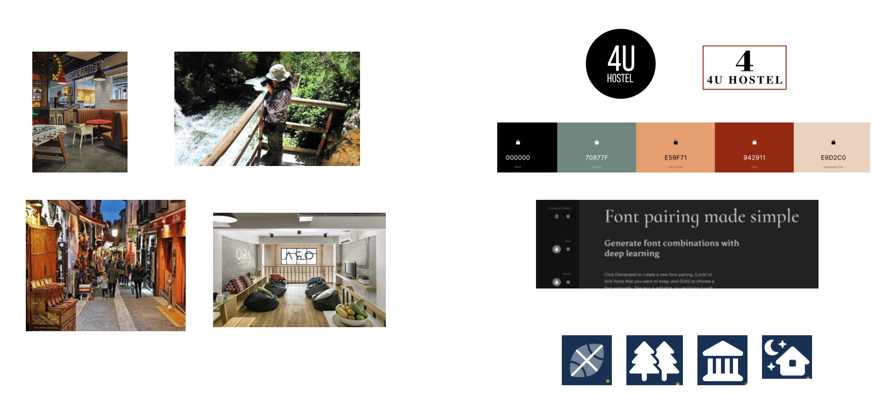
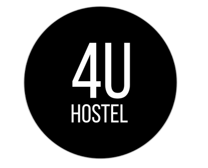
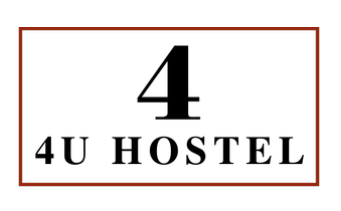
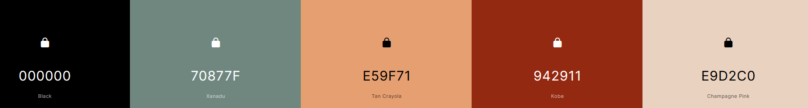
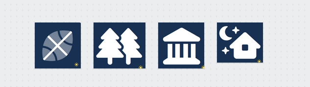

# DIU - Practica 3, entregables

## Moodboard (diseño visual + logotipo)   
Creamos un tablón con las diferentes ideas para llevar a cabo el estilo visual final. En él hemos plasmado los logos posibles, la tipografía que hemos elegido, la paleta de colores e imagenes junto con iconos de inspiración. 

## Landing Page
Partiendo del Wireframe diseñado en la práctica anterior hemos diseñado el landing page. Lo hemos hecho es crear un diseño sencillo que seduzca a nuestro usuario, para ello hemos creado un logo parecido al que tiene la página pero que llama más la atención, y un título atractivo dentro de la imagen de inicio. 

Para realizarlo hemos usado Protopie.

## Guidelines

### Logotipo

Para el logotipo hemos diseñado dos tipos de logotipos y tras revisarlos, hemos decidido quedarnos con el primero ya que llama más la atención y potencia el nombre del hostel.

Logos iniciales:

El logo finalmente escogido:

### Paleta de colores
A partir de las imagenes de inspiración del Moodboard, hemos creado la siguiente paleta de colores. Al ser una página donde se ofertan actividades hemos visto que el verde y las tonalidades marrones nos recuerdan a la naturaleza (actividades en la naturaleza) y a los monumentos y zonas turísticas (actividades culturales).

Los códigos hexadecimales son: 
- Negro #000000
- Verde #70877F
- Salmón #E59F71
- Teja #942911
- Beige #E9D2C0

### Iconos

Los iconos que hemos elegido pensamos que en tono oscuro pueden quedar bien en la web y representan el tipo de actividad mediante un icono. 

## Mockup: LAYOUT HI-FI

## Documentación: Publicación del Case Study

(incluye) Valoración del equipo sobre la realización de esta práctica o los problemas surgidos
 
