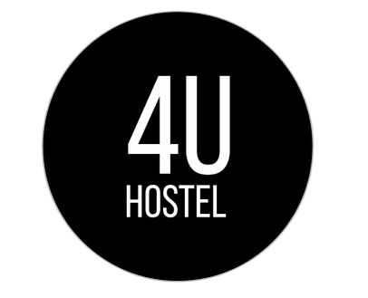
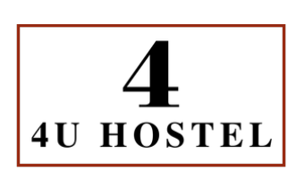
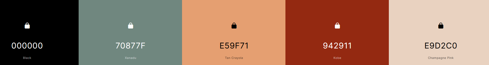
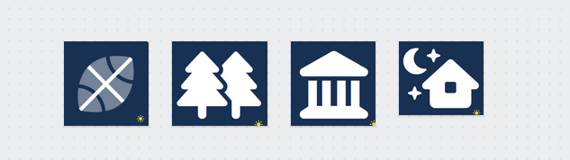

# DIU22
Prácticas Diseño Interfaces de Usuario 2021-22 (Tema: Hostels)

Grupo: DIU2.RAYSE.  Curso: 2021/22
Updated: 19/3/2022
Proyecto: 4U Hostel

## Descripción

El microsite web que vamos a diseñar consiste en un sitio web en el que los distintos clientes interesados en visitar nuestro hostel puedan encontrar todas las actividades que se ofertan, incluyendo numerosos detalles de cada una de las actividades. Además, vamos a hacer especial hincapié en mantener los puntos fuertes de la página principal del hostel. De esta manera, podremos animar al usuario objetivo a que reserve.

Las funciones principales del microsite son anunciar las diferentes actividades disponibles de la forma más atractiva posible. Esto se realizará mediante la muestra de imágenes descriptivas de las actividades. Estas actividades serán ordenadas según el interés del usuario y fecha cercana a la actual. Por último, pondremos un botón de reserva visible y atractivo para que el usuario pueda reservar.

Se dará la posibilidad de reservar una actividad y si se hace con antelación, bonificar con un descuento en la reserva. De esta manera, animamos al usuario tanto a asistir a la actividad reservando con antelación y sabiendo el número de gente que puede asistir, y además garantizar la diferenciación con la competencia.

## Logotipos

Miembros
 * :bust_in_silhouette:   BA     :octocat: https://github.com/blancabgz
 * :bust_in_silhouette:  AG     :octocat: https://github.com/antoniogamiz

-----

# Proceso de Diseño

## Paso 1. UX Desk Research & Analisis

###  1.a Competitive Analysis
-----

Compararemos Hostel4U con otros dos hostels destacados de Granada. Hostel4U se diferencia de otras páginas en que es un hostel con muy buenos precios, que se encuentra en una zona histórica y está restaurado pero conserva su toque antiguo.

###  1.b Persona
-----

Hemos creado dos usuarios.
Se ha escogido a Sophie porque es un perfil joven y un poco solitario que quiere venir al hostel para conocer gente y la cultura de Granada.

Por otro lado está Steve, se trata de un perfil más adulto que quiere disfrutar tanto de su pareja como de su trabajo.

###  1.c User Journey Map
----

Se han escogida estas experiencias de usuario porque son comunes, el problema con el idioma, que no haya alojamiento y las diferentes actividades que pueden ofrecer.
![Image text]./P1/Sophie_JourneyMap.png)

###  1.d Usability Review

Tras haber realizado el análisis de las distintas experiencias de usuario que hemos contemplado y el análisis práctico de la página web, hemos completado el análisis de la usabilidad.

[Enlace (pdf)](./P1/Usability-review-template.pdf)

[Enlace (xls)](./P1/Usability-review-template.xls)

La valoración final ha sido 62/100.
La web tiene fallos importantes de diseño ya que no se pueden ver todas las actividades y de pérdida del usuario porque contiene dos URLS (una para reserva y otra para página principal). Además tiene errores en formularios.

## Paso 2. UX Design

###  2.a Feedback Capture Grid / EMpathy map / POV
----
Tras analizar las sensaciones de Sophie y Steven, hemos creado lo siguiente:

Intentaremos mejor y solucionar los problemas que surgen con nuestra propuesta. Se trata de una web que promueve las actividades que se realizarán en el hostel y las instalaciones que tiene.

###  2.b ScopeCanvas

Hemos recogido las ideas del proyecto en el siguiente scope canvas.

###  2.b Tasks analysis
Al ser necesario pensar los diferentes tipos de usuarios que pueden visualizar la aplicación, hemos creado la siguiente tasks analysis:

###  2.c IA: Sitemap + Labelling

Término | Significado
| ------------- | -------
  Inicio  | Se trata de la página principal del sitio.
  Actividades | En esta página podremos ver las diferentes actividades que se ofertan en el hostel.
  Instalaciones | En esta página podremos ver las diferentes instalaciones que ofrece el sitio.
  Reservas | Podremos hacer las reservas de las actividades
  Galeria | Podremos ver las imagenes de las diferentes actividades
  Contacto | Podremos acceder a los datos de contacto para preguntar nuestras dudas.
  Actividades deportivas | Podremos acceder a las actividades que son únicamente deportivas
  Actividades culturales |  Podremos acceder a las actividades que son únicamente culturales
  Actividades Nocturnas | Podremos acceder a las actividades que son únicamente nocturnas

###  2.d Wireframes
-----

## Paso 3. Mi UX-Case Study (diseño)

###  3.a Moodboard

Creamos un tablón con las diferentes ideas para llevar a cabo el estilo visual final. En él hemos plasmado los logos posibles, la tipografía que hemos elegido, la paleta de colores e imagenes junto con iconos de inspiración.

###   3.b Landing Page
Partiendo del Wireframe diseñado en la práctica anterior hemos diseñado el landing page. Lo hemos hecho es crear un diseño sencillo que seduzca a nuestro usuario, para ello hemos creado un logo parecido al que tiene la página pero que llama más la atención, y un título atractivo dentro de la imagen de inicio.

Para realizarlo hemos usado Protopie.

Puedes visualizarlo en el siguiente enlace - [https://cloud.protopie.io/p/b8f782c511](https://cloud.protopie.io/p/b8f782c511).

###  3.c Guidelines

### Logotipo

Para el logotipo hemos diseñado dos tipos de logotipos y tras revisarlos, hemos decidido quedarnos con el primero ya que llama más la atención y potencia el nombre del hostel.

Logos iniciales:

El logo finalmente escogido:

### Paleta de colores
A partir de las imagenes de inspiración del Moodboard, hemos creado la siguiente paleta de colores. Al ser una página donde se ofertan actividades hemos visto que el verde y las tonalidades marrones nos recuerdan a la naturaleza (actividades en la naturaleza) y a los monumentos y zonas turísticas (actividades culturales).

Los códigos hexadecimales son:
- Negro #000000
- Verde #70877F
- Salmón #E59F71
- Teja #942911
- Beige #E9D2C0

### Iconos

Los iconos que hemos elegido pensamos que en tono oscuro pueden quedar bien en la web. Estos iconos son representativos y simples, por tanto pueden hacer que el usuario de un solo vistazo pueda localizar las actividades del tema que le interesan.

### Tipografía

En esta ocasión hemos marcado tres tipos diferentes de caligrafía.

- Títulos: se usaría Fira Sans Extrabold ya que es una tipografía Sans que es legible en todos sus formatos y es atractiva a la vista.
- Subtítulos: usaríamos el mismo tipo que la anterior pero en su versión Fira Sans Bold.
- Texto: Lato es un tipo de letra que se recomienda en textos digitales debido a su neutralidad y funcionalidad.

###   3.d Mockup

Con los prototipos y el moodboard hemos creado con ProtoPie el Mockup de web donde se pueden observar las diferentes actividades que se ofertan, filtrarlas, y acceder dentro de cada actividad a su descripción y fotografías.

Se puede ver en el siguiente link: - [https://cloud.protopie.io/p/b8f782c511](https://cloud.protopie.io/p/b8f782c511)

###  3.e ¿My UX-Case Study?
-----
El resultado del estudio lo podremos ver en el siguiente enlace - [https://antoniogamiz.github.io/DIU/](https://antoniogamiz.github.io/DIU/)

## Paso 4. Evaluación

###  4.a Caso asignado
----

>>> Breve descripción del caso asignado con enlace a  su repositorio Github

###  4.b User Testing
----

| Id | Usuarios      | Sexo/Edad              | Ocupación           |  Exp.TIC    | Personalidad | Plataforma | TestA/B
|-------------| ------------- | --------               | -----------         | ----------- | -----------  | ---------- | ----
| 1 | Elena         | M (con familia) / 34   | Diseñadora gráfica  | Alto        | Feliz        | Web        | A
| 2 | Juan José     | H (con amigos) / 20    | Estudiante          | Alto        | Disgustado   | Web        | B
| 3 | Nerea         | M (yoga) / 23                 | Voluntariado        | Baja        | Emocional    | Web        | A
| 4 | Juan          | H (mayor) / 52                 | Óptico              | Media       | Feliz        | Web        | B

Para escoger los usuarios hemos lanzado los dados y hemos intentado buscar usuarios con ese perfil entre nuestros conocidos.

- Primer personaje: 2, 6, 3. Elena es una diseñadora gráfica que le gusta pasear por el campo con sus perros. Es una firme defensora
de los animales. Trabaja en Badger Maps no solo como diseñadora gráfica pero también como UX Expert.
- Segundo personaje: 3, 1, 5. Juan José estudia Ingeniería Informática y uno de sus principales pasatiempos es jugar a los videojuegos
y salir por la noche con sus amigos.
- Tercer personaje: 1, 2, 6. Nerea ha estudiado Bioquímica e intenterá ser profesora de biología en el futuro. Por ahora no quiere empezar a
estudiar oposiciones por lo que va a viajar al extranjero a hacer tareas de voluntariado.
- Cuarto personaje: 5, 6, 3. Juan es óptico y le encanta hacer senderismo en los alrededores de Granada.

### . 4.c Cuestionario SUS
----

###  4.d Usability Report
----

>> Añadir report de usabilidad para práctica B (la de los compañeros)

>>> Valoración personal

## Conclusión final / Valoración de las prácticas

>>> (90-150 palabras) Opinión del proceso de desarrollo de diseño siguiendo metodología UX y valoración (positiva /negativa) de los resultados obtenidos

